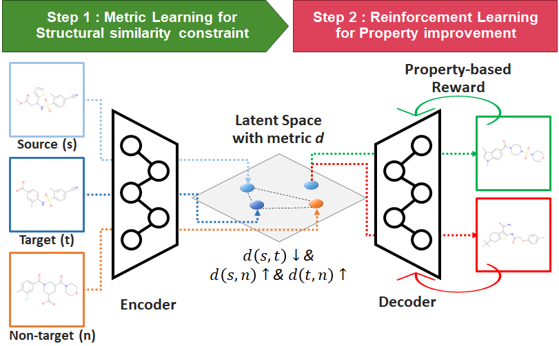

# COMA: efficient structure-constrained molecular generation using COnstractive and MArgin losses

## We regrefully inform this repo is under refactoring, which will be finished by early April.

- Latest update: 29 March 2023



This repository is for COMA, a structure-constrained molecular generative model.

For a given source molecule, COMA generates a novel molecule with more improved chemical properties by making a small modification on the source structure.

To achieve property improvement and high structural similarity simultaneously, COMA exploits reinforcement learning and metric learning.

For more detail, please refer to Choi, J., Seo, S. & Park, S. **COMA: efficient structure-constrained molecular generation using contractive and margin losses**. *J Cheminform* 15, 8 (2023). https://doi.org/10.1186/s13321-023-00679-y


--------------------------------------------------------------------------------------------
## SYSTEM REQUIERMENTS: 

- COMA requires system memory larger than 8GB.

- (if GPU is available) COMA requires GPU memory larger than 8GB.
  - Available cudatoolkit versions: 10.2, 11.1, and 11.3

- **COMA is only for Python 3.7**

--------------------------------------------------------------------------------------------
## Installation:

- We recommend to install via Anaconda (https://www.anaconda.com/)

- After installing Anaconda, please create a conda environment with the following commands:

```bash
git clone https://github.com/mathcom/COMA.git
cd COMA
conda env create -f environment.yml
```

--------------------------------------------------------------------------------------------
## Data:

- Before running tutorials, an user should decompress the compressed files: DATA/{name}.tar.gz

- The following commands are for decompression:

```bash
cd DATA
tar -xzvf drd2.tar.gz
tar -xzvf qed.tar.gz
tar -xzvf logp04.tar.gz
tar -xzvf logp06.tar.gz=
cd ..
```

- A training dataset for COMA is generated by using the jupyter notebooks 'generate_triplet_data_{PROPERTY_NAME}.ipynb' in the DATA directory
  

--------------------------------------------------------------------------------------------
## Tutorials:

- We provide several jupyter-notebooks for each benchmark.
  - 1_pretraining.ipynb
  - 2_finetuning.ipynb
  - 3_latent_space_analysis.ipynb
  - 4_translation.ipynb
  - 5_evaluation.ipynb

- These tutorial files are available for reproducibility purposes.

- An user can open them using the following commands:

```bash
conda activate coma
jupyter notebook

~ run tutorial ~

conda deactivate
```


--------------------------------------------------------------------------------------------
## Contact:

- Email: mathcombio@yonsei.ac.kr


--------------------------------------------------------------------------------------------
